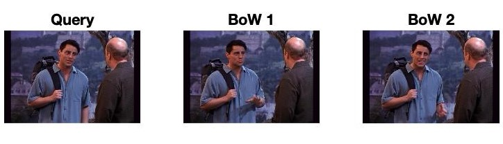
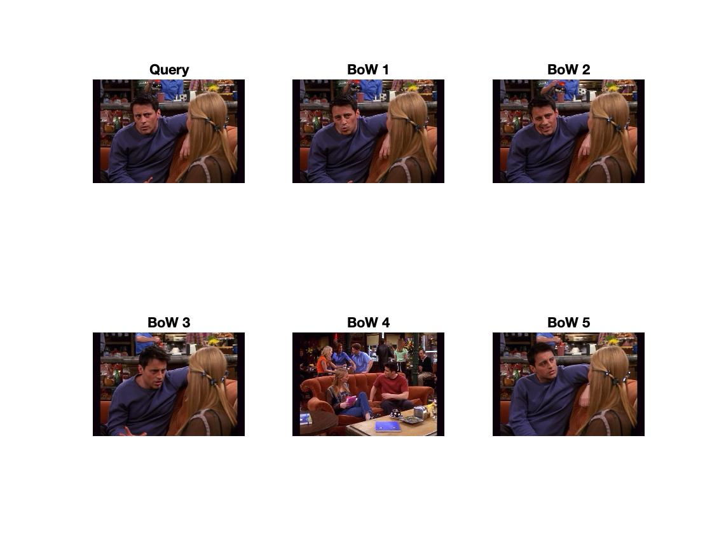
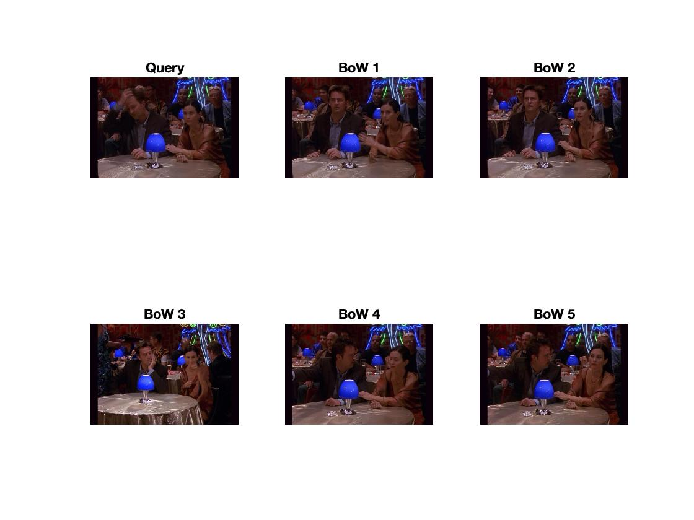
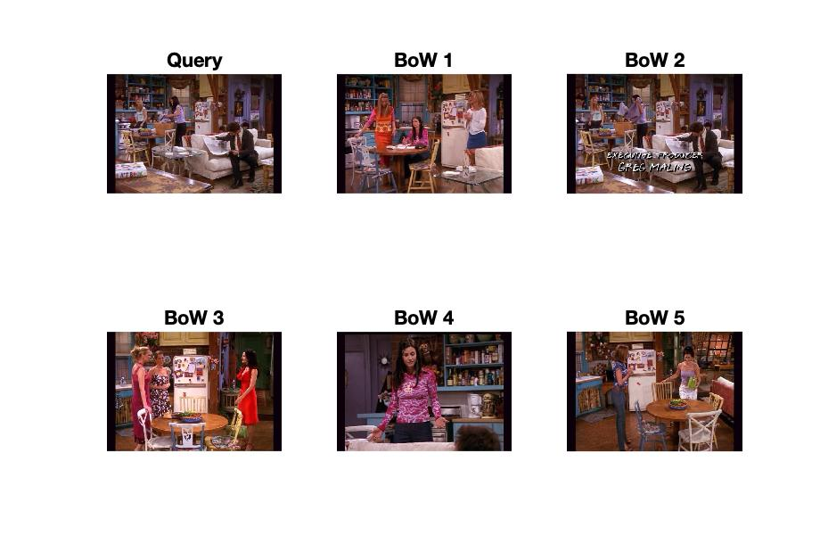

<h1 align='center'>Reverse Image Search</h1>

    
    
    

<h1></h1>

## Description

This reverse image search algorithm takes a query image and finds the most closely matching images from a bank of images. This algorithm uses the [bag of words model](https://en.wikipedia.org/wiki/Bag-of-words_model_in_computer_vision) to determine matches. In short, the bag of words model breaks down each image into a set of distinct visual patterns called words. Matches are then chosen based on how close an image's bag of words is to the query image. Naturally, the closer their words are, the stronger the match.

## How it Works

The bag of words procedure is a great demonstration of computer vision as it uses techniques which emulate how humans might identify matching images. The procedure for the algorithm is as follows:

### 1. Generate SIFT Feature Descriptors

Scale-invariant feature transform (SIFT) descriptors are essentially visual features represented as a high dimensional vector. SIFT descriptors are a robust class of feature descriptors as they are unnaffected by the scale (size) or orientation of an image. My algorithm uses these SIFT descriptors to determine what words (visual patterns) an image posseses, and therefore how closely two images match.

In order to generate SIFT features, we must first find patches in our images. Patches can be thought of as the various visual interest points that an image posseses. These interest points can manifest themselves as sharp corners or high contrast edges which make an image distinct. In order to find these points, we use the Harris corner detection filter.

    
    

        The photo on the right is an image of all of the detected patches. Notice how the items on the fridge were chosen due to their high contrast edges
    

 

Once we've found these patches, we map the visual data of each patch into high dimensional vectors (SIFT descriptors) based on pixel and gradient orientation.

### 2. Generating Our Bag of Words

Once we've generated our SIFT descriptors we combine them together in one high dimensional feature space (essentially a 128 dimensional space) and run k means clustering on this feature space. K means clustering finds different regions in our feature space where points are clustered together. These tightly clustered points are our words.

    

 

    
    

        Here you can see the different patches associated with the same word. Word 1 seems to represent eye-like features while word 2 seems to represent checkered/woven features.
    

 

### 3. Finding Matches

Finally we find the vector distance between our query image's bag of words with that of the other images in our bank and rank matches based on the closeness of this vector distance (the smaller the vector distance, the stronger the match). Take a look at some of the results:

    
    
    

